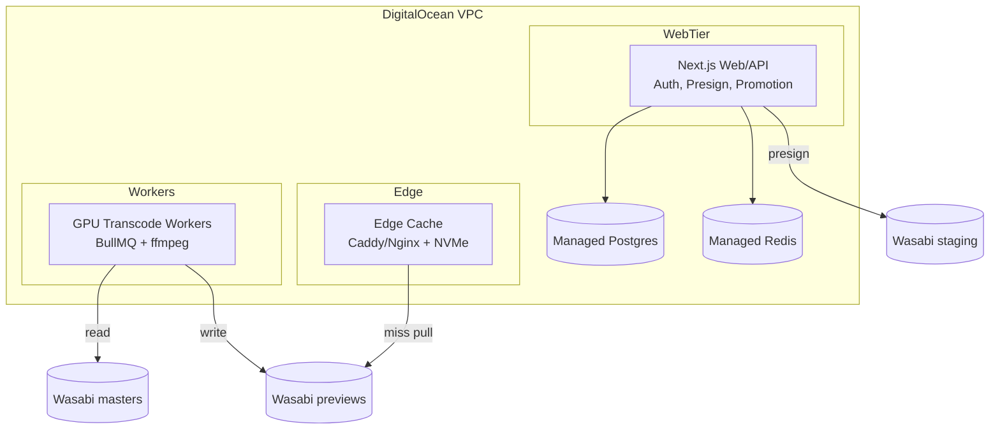
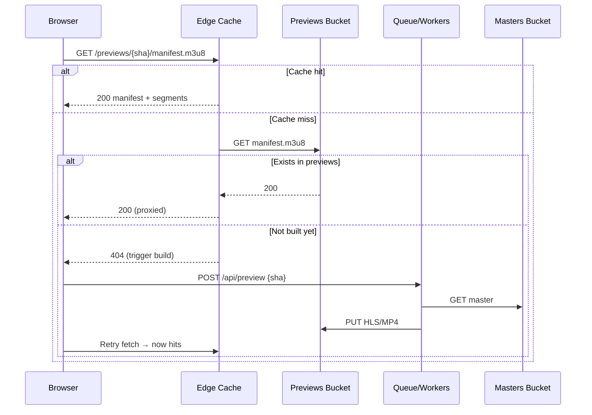
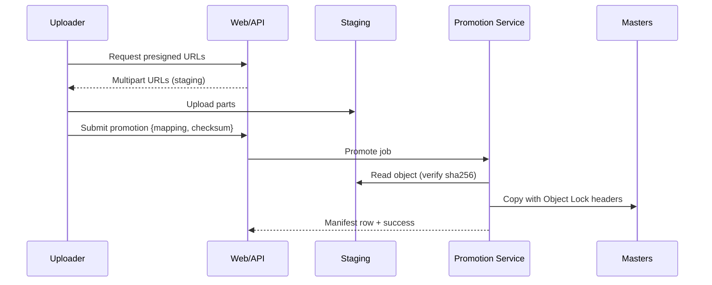

# Architecture Diagrams

System Context (C4‑1)
```mermaid
flowchart LR
  user[Client Reviewer]:::ext --> EDGE[Edge Cache\n(NVMe + Caddy)]
  editor[Producer/Editor]:::ext --> WEB[Web/API\n(Next.js)]
  admin[Admin]:::ext --> WEB

  EDGE -->|miss| PREV[(Wasabi\npreviews bucket)]
  WEB --> DB[(Managed Postgres)]
  WEB --> REDIS[(Managed Redis)]
  GPU[GPU Workers\n(ffmpeg/NVENC)] --> PREV
  GPU -->|read| MAST[(Wasabi\nmasters bucket)]
  WEB --> STAGE[(Wasabi\nstaging bucket)]
  WEB --> DOCS[(Wasabi\ndocs bucket)]

  classDef ext fill:#2b2b2b,stroke:#666,color:#fff;
```

Containers (C4‑2)


Sequence — First Playback


Sequence — Promotion (Staging → Masters)


